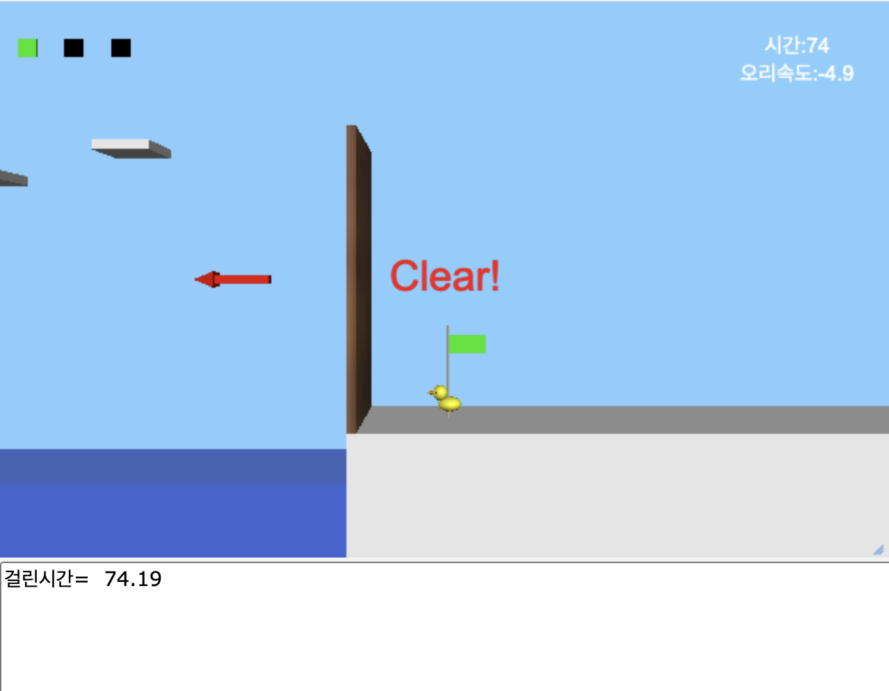

# 오리날다 (Duck Fly Game)

[여기에서 게임을 플레이하세요!][http://example.com/game-link](https://www.glowscript.org/#/user/soyoujin63/folder/Private/program/%EA%B3%BC%EC%A0%9C5)

이 게임은 VPython을 사용하여 작성된 간단한 3D 게임입니다. 플레이어는 키보드를 이용해 오리를 조작하여 장애물을 피하고 목적지까지 도달하는 것이 목표입니다.

## 게임 설명

플레이어는 오리를 좌우로 움직이고, 점프와 낙하를 통해 장애물과 바람을 피하며 목적지에 도달해야 합니다. 게임의 배경은 얼음 블록과 물, 바람으로 구성되어 있으며, 목표는 깃발에 도달하는 것입니다.

### 주요 기능
- **이동**: 화살표 키를 사용하여 오리를 왼쪽(`left`), 오른쪽(`right`), 위로(`up`), 아래로(`down`) 이동시킬 수 있습니다.
  - `left`: 오리가 왼쪽으로 이동합니다.
  - `right`: 오리가 오른쪽으로 이동합니다.
  - `up`: 오리가 점프합니다. 남은 목숨에 따라 점프 가능 횟수가 달라집니다.
  - `down`: 오리가 빠르게 내려옵니다.

- **목숨 시스템**: 게임 내에서 플레이어는 3개의 목숨을 가집니다. 점프를 할 때마다 목숨이 하나씩 줄어들며, 바닥에 착지하면 목숨이 복구됩니다.

- **바람**: 게임 화면에 바람이 발생하며, 오리의 속도와 방향에 영향을 미칩니다. 바람에 의해 오리의 움직임이 느려지거나 빨라질 수 있습니다.

- **장애물 (얼음 블록)**: 얼음 블록이 위치해 있으며, 오리가 이 블록 위에 착지할 수 있습니다. 착지하면 목숨이 복구됩니다.

- **목적지 (깃발)**: 게임의 목표는 깃발에 도달하는 것입니다. 오리가 깃발에 가까워지면 게임이 완료됩니다.

## 조작 방법
- **좌우 이동**: `왼쪽` 화살표(`←`) 또는 `오른쪽` 화살표(`→`) 키를 사용하여 오리를 좌우로 이동할 수 있습니다.
- **점프**: `위쪽` 화살표(`↑`) 키를 사용해 오리가 점프합니다.
- **낙하**: `아래쪽` 화살표(`↓`) 키를 사용해 오리를 빠르게 하강시킵니다.

## 게임 요소

### 1. 오리
- 오리는 구, 원뿔, 타원체 등으로 구성된 3D 객체입니다. 기본적으로 오른쪽을 향해 있으며, 방향을 전환할 때 회전합니다.

### 2. 얼음 블록
- 얼음 블록은 고정된 위치에 있으며, 오리가 이 블록에 착지하면 목숨이 다시 3개로 복구됩니다.

### 3. 바람
- 화면에 랜덤으로 생성되는 바람은 빨간색 화살표로 표시됩니다. 바람이 오리와 접촉하면 오리의 속도와 방향에 영향을 미칩니다.

### 4. 목표 (깃발)
- 목적지인 깃발에 도달하면 게임이 종료됩니다. 깃발은 녹색으로 변하며, 화면에 "Clear!" 메시지가 나타납니다.

### 5. 물
- 물에 빠지면 오리의 부피와 밀도에 따라 부력이 계산되며, 물에서 나오는 데 영향을 받습니다.

## 게임 규칙

1. 오리가 목적지에 도달할 때까지 장애물과 바람을 피해 이동합니다.
2. 오리가 얼음 블록에 착지하면 목숨이 복구됩니다.
3. 오리가 바람에 맞거나 물에 빠지면 속도가 변화합니다.
4. 깃발에 도착하면 게임이 종료되며, 완료 메시지가 출력됩니다.

## 게임 종료

- 오리가 깃발에 도달하면 게임이 끝납니다.
- 게임 종료 시, 화면에 "Clear!" 메시지가 표시되며, 걸린 시간이 콘솔에 출력됩니다.

## 시스템 요구 사항
- Python 3.2
- VPython 라이브러리 설치 필요 (`pip install vpython`)

## 실행 방법

1. Python 3.2가 설치된 상태에서 VPython 라이브러리를 설치합니다.
   pip install vpython
2. 게임 코드를 실행합니다.
   python FlyDuck.py
